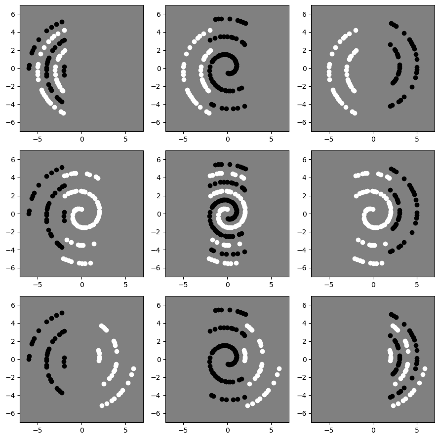
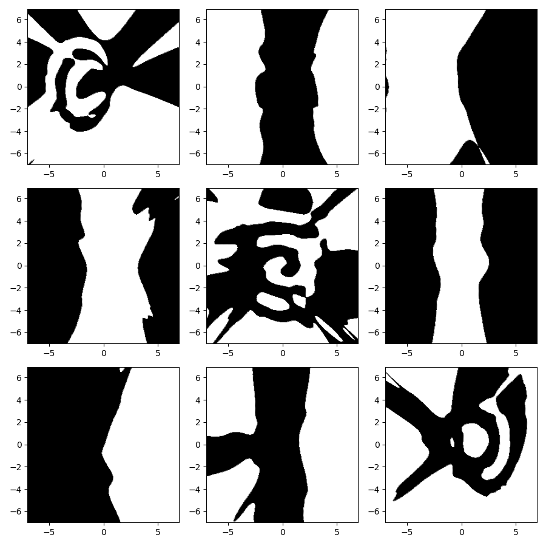
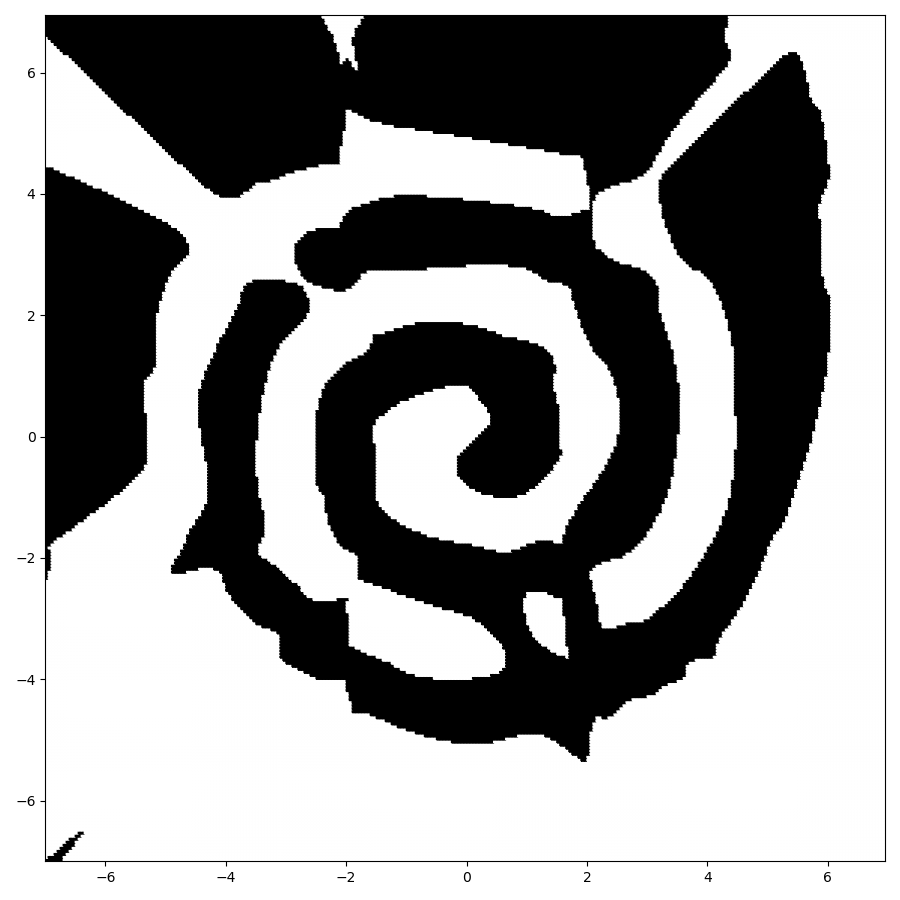

# EI328-hw1
My implementation for EI328-1: MinMax MLQP to solve 2-spirals problem.

# Environment
Python3.8 + numpy.

# Formula
The forwardpropagation rule for MLQP is defined as:

$$

x_{kj}=f(\sum_{i=1}^{N_{k-1}}(u_{kji}x_{k-1,i}^2+v_{kji}x_{k-1,i})+b_{kj})=f(\hat{x}_{kj})

$$

The backpropagation rule for MLQP is:

$$

\delta_{kj} =f'(\hat{x}_{kj})\sum_{i=1}^{N_{k+1}}\delta_{k+1,i}(2u_{k+1,ij}x_{kj}+v_{k+1,ij})

$$

Then we can update the parameters by:

$$

\Delta u_{kji}(t+1)=\alpha_u\Delta u_{kji}(t)+\eta_u\delta_{kj}x_{k-1,t}^2 \\
\Delta v_{kji}(t+1)=\alpha_v\Delta v_{kji}(t)+\eta_v\delta_{kj}x_{k-1,t} \\
\Delta b_{kj}(t+1)=\alpha_b\Delta b_{kj}(t)+\eta_b\delta_{kj}

$$

# Run Experiments
Specifically, we have implemented the `MLP` and `MLQP` for comparison, use cmd option `--model` to choose the model.

Besides, we implement the `vanilla` and `minmax` NN module for comparison, use cmd option `--type` to choose the module.

For the `minmax` model, you can use `--partition_mode` to choose the data partition model (random, yaxis, or yaxis+overlap). You can also use `--partition_num` to choose the partition number. Use `--train_mode` to choose the parallel or sequential training modes.

The learning rates, momentums and hidden channel sizes (but only one hidden channel w.r.t. the homework requirements) can also be tuned using the cmd option.

Finally, you can use `--seed` to fix the random seed for reproducibility.

Typically, you can run a minmax MLQP in parallel mode use the following command:
```shell
python main.py --lr_1 0.1 --lr_2 0.01 --alpha_1 0.9 --alpha_2 0.9 --n_hid 32 --model mlqp --type minmax --seed 42 --partition_num 3 --partition_mode yaxis+overlap --n_epoch 10000 --training_mode parallel
```

For convenience, we have written two shell scripts to study the influence of learning rates and partition modes, run them by:
```shell
bash test_lr_alpha.sh
bash test_partition.sh
```

# Results
We show part of results here. The data partition distribution is:



The decision boundary for each submodule is:



The finally decision boundary after the min-max operation is:


